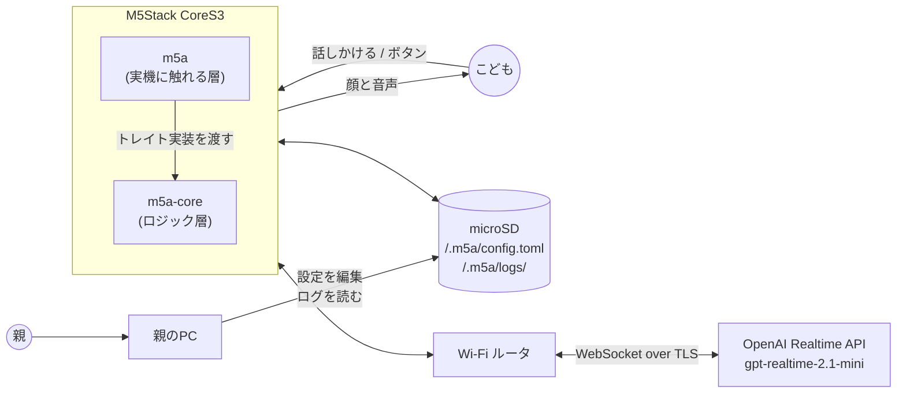
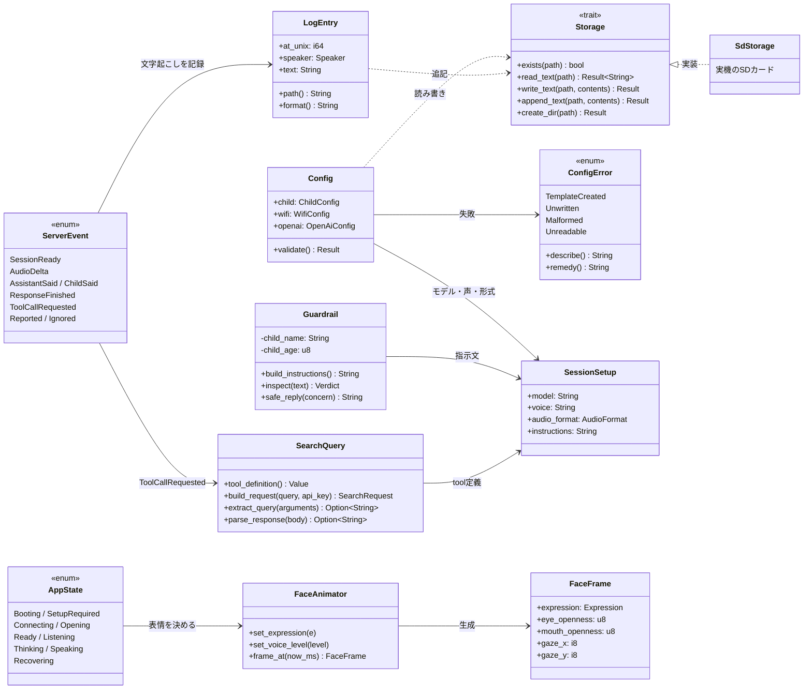

# 構成と責務

## 配置図

## クラス図

## 責務の割り当て

### `m5a-core`

| モジュール | 責務 |
|---|---|
| `ports` | 外界に触れるためのトレイトと、試験用のメモリ実装 |
| `config` | TOML 設定の雛形生成・解析・検証 |
| `state` | 状態遷移。状態ときっかけから次の状態と依頼する処理を決める |
| `face` | 時刻から表情のかたちを決める |
| `layout` | 表情を画面のどこにどの色で置くかを決める |
| `guardrail` | 指示文の組み立てと、文字起こしの検査 |
| `realtime` | Realtime API の電文の組み立てと解析 |
| `search` | web検索（Tavily）の tool 定義・リクエストの組み立て・結果の解析 |
| `audio` | μ-law 変換、標本化周波数の変換、音量の算出 |
| `logbook` | 会話ログの整形と追記 |

### `m5a`

| モジュール | 責務 |
|---|---|
| `hal::board` | BSP の呼び出し。I2C・画面・明るさ・SDカード・LVGL の鍵 |
| `hal::face` | 配置を LVGL の部品に反映する |
| `hal::touch` | LVGL が読んだ指の状態から押下・解放を取り出す |
| `hal::storage` | カード上のファイル操作（`Storage` の実装） |
| `hal::search` | Tavily への実際の HTTPS 通信（別スレッド + チャンネル） |
| `main` | 起動順序の制御と、状態遷移にもとづく処理の実行 |

BSP が引き受けている範囲は次のとおり。自前で持たない。

| 対象 | 引き受けるもの |
|---|---|
| AXP2101 / AW9523 | 給電とバックライト |
| ILI9342C | LCD の初期化と描画転送 |
| FT5x06 系タッチ | 読み取りと LVGL への受け渡し |
| microSD | マウントと SPI バスの取り合い |
| LVGL | フレームバッファと部分更新 |
