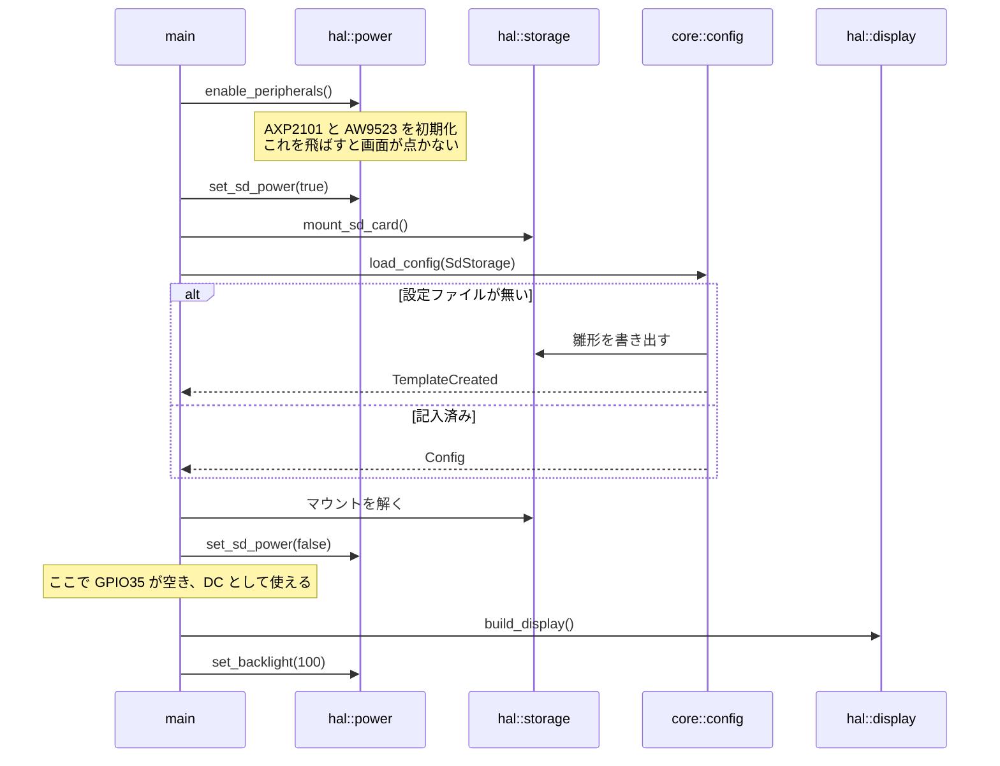
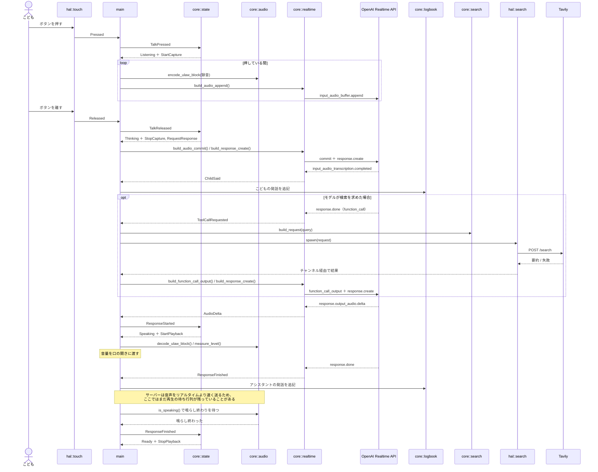
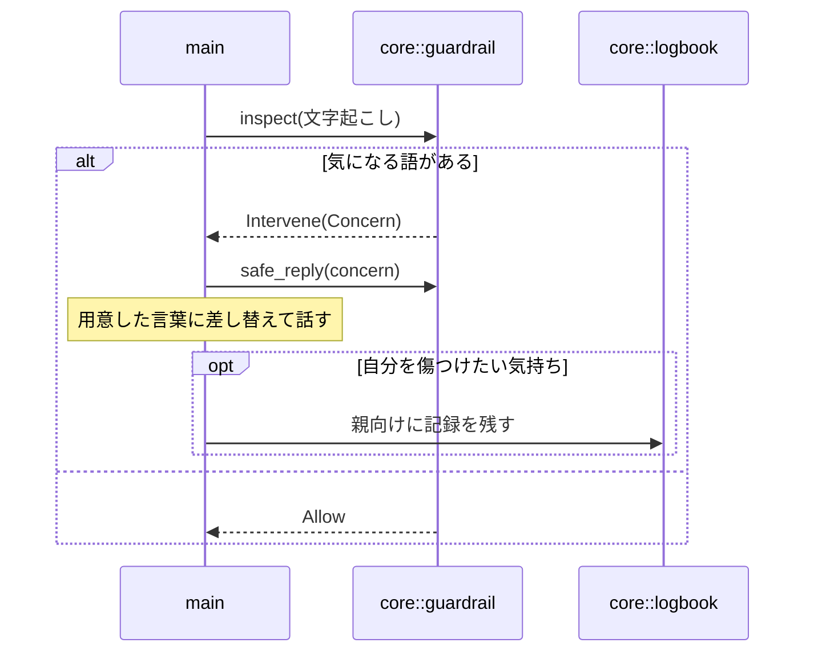

# 対話の流れ

## 起動から待機まで

SD カードと LCD が同じ端子を分け合うため、順序に意味がある。

```mermaid
sequenceDiagram
  participant Main as main
  participant Power as hal::power
  participant SD as hal::storage
  participant Cfg as core::config
  participant LCD as hal::display

  Main->>Power: enable_peripherals()
  Note over Power: AXP2101 と AW9523 を初期化<br/>これを飛ばすと画面が点かない
  Main->>Power: set_sd_power(true)
  Main->>SD: mount_sd_card()
  Main->>Cfg: load_config(SdStorage)
  alt 設定ファイルが無い
    Cfg->>SD: 雛形を書き出す
    Cfg-->>Main: TemplateCreated
  else 記入済み
    Cfg-->>Main: Config
  end
  Main->>SD: マウントを解く
  Main->>Power: set_sd_power(false)
  Note over Main: ここで GPIO35 が空き、DC として使える
  Main->>LCD: build_display()
  Main->>Power: set_backlight(100)
```

## ひとつのやりとり

```mermaid
sequenceDiagram
  actor Child as こども
  participant Touch as hal::touch
  participant Main as main
  participant State as core::state
  participant Audio as core::audio
  participant Proto as core::realtime
  participant API as OpenAI Realtime API
  participant Log as core::logbook
  participant Search as core::search
  participant HalSearch as hal::search
  participant Tavily as Tavily

  Child->>Touch: ボタンを押す
  Touch->>Main: Pressed
  Main->>State: TalkPressed
  State-->>Main: Listening ＋ StartCapture

  loop 押している間
    Main->>Audio: encode_ulaw_block(録音)
    Main->>Proto: build_audio_append()
    Proto->>API: input_audio_buffer.append
  end

  Child->>Touch: ボタンを離す
  Touch->>Main: Released
  Main->>State: TalkReleased
  State-->>Main: Thinking ＋ StopCapture, RequestResponse
  Main->>Proto: build_audio_commit() / build_response_create()
  Proto->>API: commit ＋ response.create

  API-->>Proto: input_audio_transcription.completed
  Proto-->>Main: ChildSaid
  Main->>Log: こどもの発話を追記

  opt モデルが検索を求めた場合
    API-->>Proto: response.done（function_call）
    Proto-->>Main: ToolCallRequested
    Main->>Search: build_request(query)
    Main->>HalSearch: spawn(request)
    HalSearch->>Tavily: POST /search
    Tavily-->>HalSearch: 要約 / 失敗
    HalSearch-->>Main: チャンネル経由で結果
    Main->>Proto: build_function_call_output() / build_response_create()
    Proto->>API: function_call_output ＋ response.create
  end

  API-->>Proto: response.output_audio.delta
  Proto-->>Main: AudioDelta
  Main->>State: ResponseStarted
  State-->>Main: Speaking ＋ StartPlayback
  Main->>Audio: decode_ulaw_block() / measure_level()
  Note over Main: 音量を口の開きに渡す

  API-->>Proto: response.done
  Proto-->>Main: ResponseFinished
  Main->>Log: アシスタントの発話を追記
  Note over Main,Audio: サーバーは音声をリアルタイムより速く送るため、<br/>ここではまだ再生の待ち行列が残っていることがある
  Main->>Audio: is_speaking() で鳴らし終わりを待つ
  Audio-->>Main: 鳴らし終わった
  Main->>State: ResponseFinished
  State-->>Main: Ready ＋ StopPlayback
```

## ガードレールの割り込み

```mermaid
sequenceDiagram
  participant Main as main
  participant Guard as core::guardrail
  participant Log as core::logbook

  Main->>Guard: inspect(文字起こし)
  alt 気になる語がある
    Guard-->>Main: Intervene(Concern)
    Main->>Guard: safe_reply(concern)
    Note over Main: 用意した言葉に差し替えて話す
    opt 自分を傷つけたい気持ち
      Main->>Log: 親向けに記録を残す
    end
  else
    Guard-->>Main: Allow
  end
```
