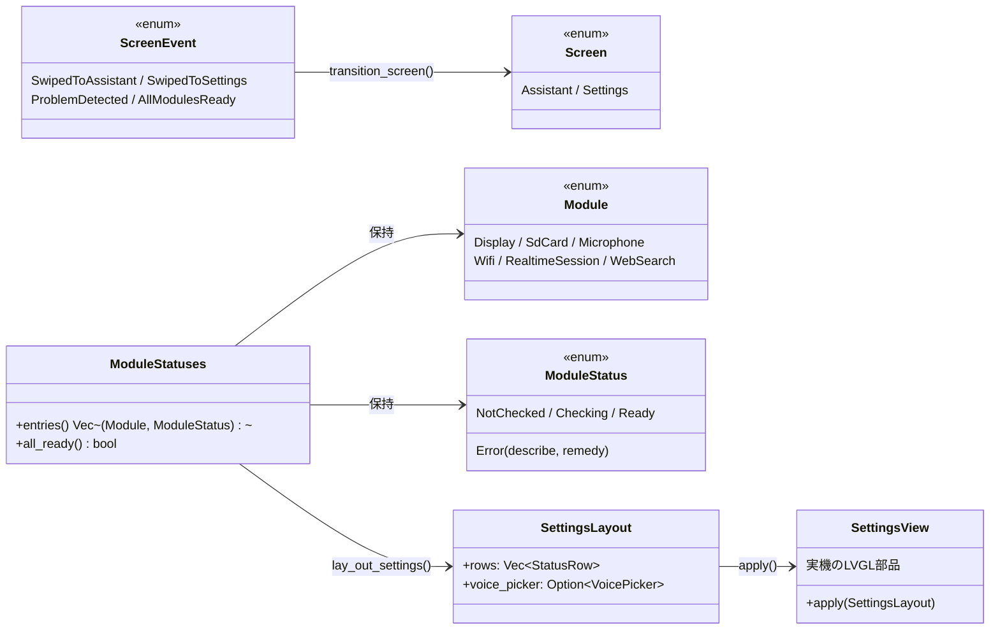

# 設定画面の設計

[設定画面](../spec/settings.md)の仕様を実現する、コア層と実機層の分担。

## クラス図

## 状態遷移図

[状態遷移](state.md#画面遷移) に記載した通り、`Screen` は `AppState`
とは独立した状態機械。起動直後は必ず `Settings` から始まり、
`AppState` が `SetupRequired`／`Recovering` に入った瞬間に強制的に
`Settings` へ、監視対象の全モジュールが `Ready` になったら自動的に
`Assistant` へ戻る。

## モジュールごとの準備状況の更新場所

`ModuleStatuses`（`core/src/module_status.rs`）は `main.rs` の
`Runtime` が持ち、各モジュールの初期化・接続処理のたびに更新する。

| モジュール | 更新する場所 |
|---|---|
| 画面 | 常に `Ready` 固定。描画できている時点で動いているとみなす（起動できなければ設定画面自体を出せないため、失敗は検出できない既知の制約） |
| SDカード | 起動時は `sd_card_status()`（`settings: Result<Config, ConfigError>` から判定）。実行中は `Runtime::flush_logs()` の書き込み失敗 |
| マイク | `Runtime::open_audio()` |
| WiFi | `Runtime::connect_network()`。開始時に `Checking`、成否で `Ready`／`Error` |
| 話す相手 | `Runtime::open_session()` で `Checking` にし、`Session::open` の成否で `Error` へ。実際に `Ready` になるのは `ServerEvent::SessionConfigured` を受けた `Runtime::receive()` |
| インターネット検索 | `Runtime::new()` で `config.search.api_key()` の有無だけを見て決める（実際の疎通確認はしない） |

画面の文字は英語のみとする（実機に日本語フォントを組み込んでいないため）。
`core::state::Failure::describe()`/`remedy()` や `ConfigError::describe()`/
`remedy()` は会話ログ向けの日本語文言のため、そのままでは画面に出さない。
`main.rs::module_error()`／`sd_card_status()` が `ModuleStatus::Error` 用に
英語の文言を別途組み立てる。

## レイアウトと描画

`core/src/settings_layout.rs::lay_out_settings()` が、[顔と画面](../spec/face.md)
と同じ考え方で「どこに何を置くか」だけを純関数で決める。モジュールの数
（インターネット検索の有無）によって縦の長さが変わるため、標準構成
（検索なし・最大5行＋声の一覧）は画面の高さ240pxに収まるようにし、
検索を含む6行構成では画面をスクロールして見せる
（`hal::settings_view::SettingsView` がコンテナに縦スクロールを許可する）。

アイコンは LVGL 9.5.0 の組み込みシンボルフォント（`lv_symbol_def.h`）の
コードポイントを `hal::settings_view` 内で直接指定している。
`esp-idf-sys` の bindgen 出力はマクロである `LV_SYMBOL_*` を定数として
持たないため、`\u{F1EB}`（WiFi）のような Unicode 私用領域の文字リテラルを
Rust 側に複製する形をとった。

## 声の選択とタッチ判定

声のボタンのタップ判定は `core/src/settings_layout.rs::voice_at()` が
純関数として行い、`main.rs` はタッチが離れた座標をそのまま渡すだけで
どのボタンに当たったかを得る。当たったら `Runtime::select_voice()` が
`Config` を更新しつつ `core::config::save_voice()` で SDカードへ書き戻す。

## スワイプ判定

`core::gesture::detect_swipe()` が押し始めと離した座標から左右スワイプを
判定する純関数。`hal::touch::TouchReader` は座標付きの
`Pressed`／`Moved`／`Released` を返すよう拡張し、`main.rs` が押し始めの
座標を覚えておいて離した瞬間に判定する。

## 未解決の項目

* 画面の文字は英語のみとした（[仕様](../spec/settings.md#画面の文字は英語のみ)を参照）ため
  日本語フォントの組み込みは不要になったが、実機での見た目（文字の可読性・
  レイアウトの収まり具合）はまだ確認していない。現状のビルドは
  `xtensa-esp32s3-espidf` ターゲットでコンパイルは通る
