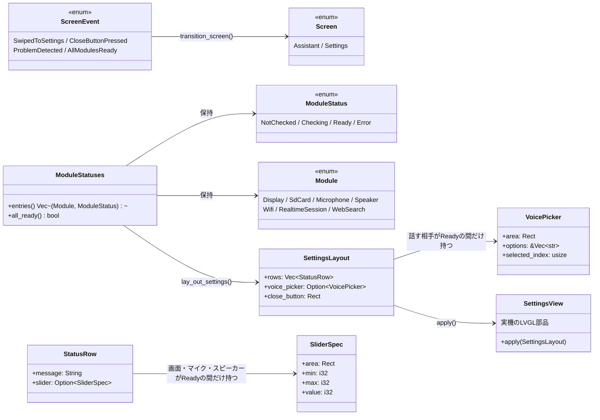

# 設定画面の設計

[設定画面](../spec/settings.md)の仕様を実現する、コア層と実機層の分担。

## クラス図

## 状態遷移図

[状態遷移](state.md#画面遷移) に記載した通り、`Screen` は `AppState`
とは独立した状態機械。起動直後は必ず `Settings` から始まり、
`AppState` が `SetupRequired`／`Recovering` に入った瞬間に強制的に
`Settings` へ、監視対象の全モジュールが `Ready` になったら自動的に
`Assistant` へ戻る。

## モジュールごとの準備状況の更新場所

`ModuleStatuses`（`core/src/module_status.rs`）は `main.rs` の
`Runtime` が持ち、各モジュールの初期化・接続処理のたびに更新する。

| モジュール | 更新する場所 |
|---|---|
| 画面 | 常に `Ready` 固定。描画できている時点で動いているとみなす（起動できなければ設定画面自体を出せないため、失敗は検出できない既知の制約）。常に `Ready` なので、明るさスライダーは起動直後から出る |
| SDカード | 起動時は `sd_card_status()`（`settings: Result<Config, ConfigError>` から判定）。実行中は `Runtime::flush_logs()` の書き込み失敗で `Error` へ（自動でやり直す仕組みは無い） |
| マイク | `Runtime::open_audio()`。起動時に一度だけ試すのみで、失敗したら再試行はしない |
| スピーカー | マイクと同じ `Runtime::open_audio()`（`hal::audio::Audio::start()` が両方を一度に開くため、成否も同時に決まる） |
| WiFi | `Runtime::connect_network()`。開始時に `Checking`、成功で `Ready`。失敗しても `Error` にはせず `Checking` のまま留める（後述） |
| 話す相手 | `Runtime::open_session()` で `Checking` にする。実際に `Ready` になるのは `ServerEvent::SessionConfigured` を受けた `Runtime::receive()`。失敗しても `Error` にはせず `Checking` のまま留める（後述） |
| インターネット検索 | `Runtime::new()` で `config.search.api_key()` の有無だけを見て決める（実際の疎通確認はしない） |

画面には `Ready` / `Checking...` / `Failed` の3種類の短い単語しか出さない。
何が起きたか・どう直すかの詳しい理由（`core::state::Failure::describe()`/
`remedy()` や `ConfigError::describe()`/`remedy()`）は、5歳児向けの画面に
長い英文を出しても読めないため出さず、シリアルログにだけ残す。
`ModuleStatus::Error` はデータを持たない単純な印で、失敗の理由ごとに
文言を作り分けることはしない。

### `Failed` を出すのは自動でやり直さない場合だけ

WiFi・話す相手は失敗しても `AppState::Recovering` を経て
`schedule_retry()` が3秒後に自動でやり直し続ける
（[状態遷移](state.md#画面遷移)参照）。この2つを失敗のたびに
`Error`（`Failed`表示）にすると、再接続を試みるたびに
`Checking... → Failed → Checking...` と点滅して見え、実際には
自動で直ろうとしているのに壊れたままに見えてしまう。そのため
この2つは失敗しても `Checking` のまま留め、`Failed` を出さない。
マイク・SDカードにはこの自動リトライの仕組みが無いため、
失敗したら素直に `Error`（`Failed`表示）にする。

## レイアウトと描画

`core/src/settings_layout.rs::lay_out_settings()` が、[顔と画面](../spec/face.md)
と同じ考え方で「どこに何を置くか」だけを純関数で決める。モジュールの数
（インターネット検索の有無）によって縦の長さが変わるため、標準構成
（検索なし・6行）は画面の高さ240pxに収まるようにし、検索を含む7行構成では
画面をスクロールして見せる（`hal::settings_view::SettingsView` がコンテナに
縦スクロールを許可する）。画面いちばん上には閉じるボタン専用の帯
（`HEADER_HEIGHT`）を確保し、モジュール一覧はその下から並べる。

声の選択をボタンの2段×5列グリッドからコンボボックス1個に変えたことで
浮いた縦のスペースを、この閉じるボタン用の帯に充てている
（[声の選択とタッチ判定](#声の選択とタッチ判定)参照）。

各行はアイコンと状態文だけを持ち、モジュール名の文字は出さない。
アイコンだけでどのモジュールかは伝わるため、別に名前を添える
必要がないと判断した。

アイコンは LVGL 9.5.0 の組み込みシンボルフォント（`lv_symbol_def.h`）の
コードポイントを `hal::settings_view` 内で直接指定している。
`esp-idf-sys` の bindgen 出力はマクロである `LV_SYMBOL_*` を定数として
持たないため、`\u{F1EB}`（WiFi）のような Unicode 私用領域の文字リテラルを
Rust 側に複製する形をとった。既定の 14px フォントでは小さすぎるため、
アイコンの文字だけ `sdkconfig.defaults` で有効にした 20px の
`lv_font_montserrat_20` を当てている。

## 声の選択とタッチ判定

声の選択は、当たり判定・開閉・一覧の描画をすべて LVGL 標準の
`lv_dropdown`（コンボボックス）にまかせている。以前はボタンの
2段×5列グリッドを自前で並べ、タップ位置の当たり判定
（`core::settings_layout::voice_at()`、現在は削除済み）を純関数で
書いていたが、ドラッグを扱うスライダーと同じ理由（[画面の明るさ・
スピーカー音量・マイク感度のスライダー](#画面の明るさスピーカー音量マイク感度のスライダー)参照）で
ライブラリの部品に置き換えた。コアは選択肢の並び（`SUPPORTED_VOICES`）と
コンボボックスの配置・現在の選択位置（`VoicePicker`）だけを決め、
実機層は `main.rs::run()` の毎コマで `SettingsView::voice_selection()`
（`lv_dropdown_get_selected()` を読むだけ）を呼び、選ばれた声が変わって
いれば `Runtime::select_voice()` で `Config` を更新しつつ
`core::config::save_voice()` で SDカードへ書き戻す。声の変更はタップ一発の
離散的な操作のため、スライダーのような「ドラッグ中は保存を待つ」仕組みは
要らない（`select_voice()` 自体が値が変わっていなければ何もしないため、
毎コマ呼んでも無駄な書き込みは起きない）。

コンボボックスは、スピーカーの音量スライダーと同じ行に並べて置く
（[レイアウトと描画](#レイアウトと描画)参照）。話す相手（RealtimeSession）
が準備できていない間は現れない。

## 画面の明るさ・スピーカー音量・マイク感度のスライダー

声のボタンとは違い、ドラッグという連続した操作を扱うため、当たり判定を
自前で書かず LVGL 標準の `lv_slider` ウィジェットにまかせている。
つまみの描画・ドラッグの追従は LVGL 自身のタスクが行い、こちらは
値の読み書きだけを行う。3つのスライダーとも仕組みは共通で、範囲だけが
異なる（`core::settings_layout::BRIGHTNESS_MIN/MAX` など）。

**ライブ反映と保存の分離** — ドラッグ中は毎コマ値を読み、実際の明るさ・
音量・感度（`hal::board::set_brightness()`、`hal::audio::Audio::set_speaker_volume()`/
`set_mic_gain()`）へは即座に反映する一方、`/.m5a/config.toml` への
書き込みは指を離した瞬間だけに絞る。毎コマSDカードへ書き込むと、
書き込み回数がドラッグのコマ数（1回のドラッグで数十回）ぶん膨らみ、
SDカードの摩耗と処理落ちの原因になるため。指を離した瞬間は
`lv_obj_has_state(slider, LV_STATE_PRESSED)` の変化（真→偽）を毎コマ見て
検出する（`hal::settings_view::read_slider()`）。

**スピーカー・マイクはハードを固定し、デジタルゲインで上下させる** —
音量・感度スライダーの値は、もはやハードの音量・感度そのものではない。
`hal::audio::Audio::start()` は起動時に一度だけ、スピーカーの音量を
`esp_codec_dev_set_out_vol` で常に100%へ、マイクの感度を
`esp_codec_dev_set_in_gain` で常に固定値（`FIXED_MIC_GAIN_DB`、42dB）へ
設定し、以後変えない。スライダーの0〜100は、その固定したハードの
出力・入力へ掛ける倍率（`m5a_core::audio::speaker_gain_multiplier()`/
`mic_gain_multiplier()`）に変換され、録音・再生の仕事スレッドが
波形サンプルへ直接掛ける（`m5a_core::audio::apply_gain()`、
signed 16bit の範囲を超えた分はクリップ）。ハードの上限を先に
使い切ってから、その上をデジタルゲインだけで連続的に引き上げ／
引き下げられるようにするための構成で、スピーカーは50%が
「ハードの音量を100%にしていた頃の音量」に相当する基準点、
マイクは0%が「上乗せ無し（ハード固定値のまま）」に相当する基準点になる。
値は `hal::audio::Audio::set_speaker_volume()`/`set_mic_gain()` で
`Arc<AtomicU8>` へ渡すだけで、コーデックの取っ手（各仕事スレッドの中に
閉じ込められている）へは触れない。

**明るさだけはハードを直接その場で変えられる** —
バックライトの制御は BSP の同期呼び出し（`bsp_display_brightness_set`）
一つで完結し、録音・再生のように専用スレッドに取っ手が閉じ込められて
いないため、`Runtime::adjust_brightness()` から `board::set_brightness()`
を直接その場で呼ぶだけでよい。デジタルゲインのような波形処理を挟む
必要が無い。

**この一コマの描画に間に合わせる** — `main.rs::run()` は、この一コマの
`SettingsLayout` を作る前に `SettingsView::brightness()`/`speaker_volume()`/
`mic_gain()` でつまみの現在値を読み、`Runtime::adjust_brightness()`/
`adjust_speaker_volume()`/`adjust_mic_gain()` で `Config` に反映してから
レイアウトを作る。順序を逆にすると、この一コマの描画がまだ古い値のまま
作られ、`SettingsView::apply()` がドラッグ中のつまみを一つ前の値へ
引き戻してしまう（[レイアウトと描画](#レイアウトと描画)の
`apply()` は配置が変わったときだけ書き戻す設計と組み合わさって、
本来は無害なはずの書き戻しが一コマ遅れると悪さをする）。

**起動直後の明るさは、SDカードを読むまで既定値を使う** — 画面は
SDカードのマウントより前に初期化するため、`config.toml` の
`[display] brightness` を読める段階ではまだ画面が動いていない。
`main()` は `board::start_display()` の直後、`SCREEN_BRIGHTNESS`
（既定50%）で一旦点灯させ、設定を読み終えた時点で
`board::set_brightness(config.display.brightness)` を呼んで
親の設定値に差し替える。

## 閉じるボタン

画面右上（閉じるボタン専用の帯、[レイアウトと描画](#レイアウトと描画)参照）
に置く固定のボタン。声のボタンをやめた今も、この❌は当たり判定を
`core::settings_layout::close_button_at()` という純関数で自前に持つ——
連続したドラッグを扱うスライダーやコンボボックスとは違い、単発のタップ
一つだけなので、既存の「タッチが離れた座標を渡して当たったか確かめる」
という他のボタンと同じやり方で十分だったため、ここだけライブラリの
部品にはしていない。

タップされたら `screen::transition_screen(screen, ScreenEvent::CloseButtonPressed)`
を呼ぶ。設定画面からアシスタント画面へ戻る手段は、この閉じるボタンと
[全モジュール準備完了による自動復帰](#全モジュール準備完了による自動復帰との競合)
の2つだけで、**スワイプでは戻れない**（後述）。

## スワイプ判定

`core::gesture::detect_swipe()` が押し始めと現在（または離した）座標から
左右スワイプを判定する純関数。`hal::touch::TouchReader` は座標付きの
`Pressed`／`Moved`／`Released` を返すよう拡張してあり、`main.rs` は
押し始めの座標を覚えておいて、指が動くたび（`Moved`）に毎回スワイプに
なっていないか判定する。**指を離すのを待たない**——アシスタント画面は
画面全体が「おはなしボタン」の当たり判定を兼ねており（[顔と画面](../spec/face.md)
参照）、離すまで判定を待つと、録音が始まったまま切り替わらないように
見えるため。移動量が閾値を超えて実際にスワイプと分かった瞬間に
`swipe_start` を `None` に戻して即座に画面を切り替え、`Released` 側での
二重判定を避ける（指を動かさずに離した「タップ」だけが `Released` 側の
判定に残る）。

**設定画面を閉じる方向のスワイプには対応しない** —
`main.rs::screen_event_of()` は左スワイプ（`SwipeDirection::Left`、
設定画面を開く方向）だけを `ScreenEvent::SwipedToSettings` に変換し、
右スワイプ（閉じる方向）には対応するきっかけを返さない
（`Option<ScreenEvent>` の `None`）。閉じる操作を誤って行ってしまう
事故を減らし、閉じる手段を閉じるボタンだけに絞るための意図的な非対称。
`handle_swipe()` はそれでも、押した瞬間に始まってしまっていた録音の
後始末（次項）だけは方向によらず行う。

押した瞬間はスワイプかタップか分からず、アシスタント画面では先に
録音を始めてしまっている。指が動いてスワイプだったと分かったら
（`main.rs::handle_swipe()`）、それが画面を切り替えない右スワイプで
あっても、`AppEvent::SpeechNotDetected` を送って「何も言わずに録音を
終えた」ことにし、静かに `Ready` へ戻す（新しいイベントは増やさず、
既存の「声が無いまま沈黙が続いた」経路を再利用している）。

### 全モジュール準備完了による自動復帰との競合

設定画面には「全モジュールが揃ったら自動でアシスタント画面に戻る」
仕組みがある（[状態遷移](state.md#画面遷移)参照）。モジュールが
すでに揃っている状態で親がスワイプして設定画面を開くと、次のフレーム
（40ms後）にこの自動復帰が働いて即座に押し戻され、操作できないように
見えてしまう。これを避けるため `main.rs::run()` は
`auto_return_to_assistant: bool` を持ち、手動スワイプで設定画面を
開いたときは `false` にして自動復帰を抑止する。抑止は
`AppState::SetupRequired`／`Recovering` に入った（＝親が対処すべき
問題が起きた）瞬間に再び `true` へ戻す。

## 起動時の表示

設定画面（と顔）の LVGL 部品は、画面が使えるようになった直後
（`board::start_display()` 後）に `main()` で一度作り、SDカードの
マウントや設定読み込みより前に一度 `SettingsView::apply()` する。
これにより、電源投入から設定画面が映るまでの時間を、SDカードの
処理時間ぶん短縮している（`main.rs::show_booting_screen()`）。

## 未解決の項目

* 画面の文字は英語のみとした（[仕様](../spec/settings.md#画面の文字は英語のみ)を参照）ため
  日本語フォントの組み込みは不要になったが、実機での見た目（文字の可読性・
  レイアウトの収まり具合、アイコンの大きさ）はまだ確認していない。
  現状のビルドは `xtensa-esp32s3-espidf` ターゲットでリンクまで通る
