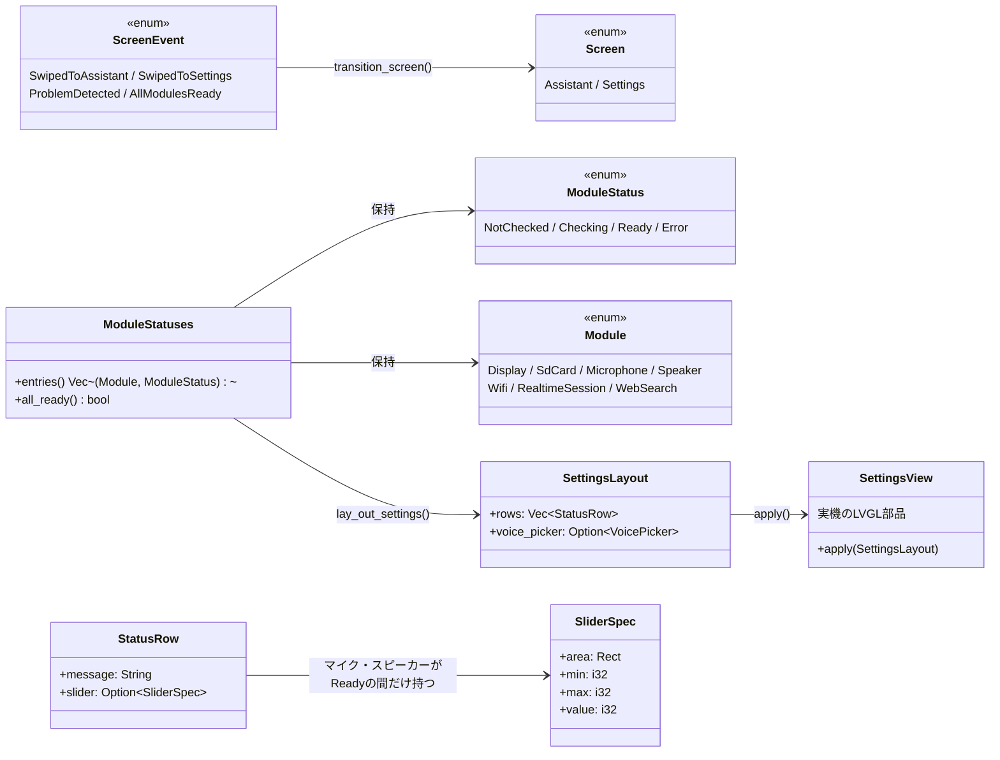

# 設定画面の設計

[設定画面](../spec/settings.md)の仕様を実現する、コア層と実機層の分担。

## クラス図

## 状態遷移図

[状態遷移](state.md#画面遷移) に記載した通り、`Screen` は `AppState`
とは独立した状態機械。起動直後は必ず `Settings` から始まり、
`AppState` が `SetupRequired`／`Recovering` に入った瞬間に強制的に
`Settings` へ、監視対象の全モジュールが `Ready` になったら自動的に
`Assistant` へ戻る。

## モジュールごとの準備状況の更新場所

`ModuleStatuses`（`core/src/module_status.rs`）は `main.rs` の
`Runtime` が持ち、各モジュールの初期化・接続処理のたびに更新する。

| モジュール | 更新する場所 |
|---|---|
| 画面 | 常に `Ready` 固定。描画できている時点で動いているとみなす（起動できなければ設定画面自体を出せないため、失敗は検出できない既知の制約） |
| SDカード | 起動時は `sd_card_status()`（`settings: Result<Config, ConfigError>` から判定）。実行中は `Runtime::flush_logs()` の書き込み失敗で `Error` へ（自動でやり直す仕組みは無い） |
| マイク | `Runtime::open_audio()`。起動時に一度だけ試すのみで、失敗したら再試行はしない |
| スピーカー | マイクと同じ `Runtime::open_audio()`（`hal::audio::Audio::start()` が両方を一度に開くため、成否も同時に決まる） |
| WiFi | `Runtime::connect_network()`。開始時に `Checking`、成功で `Ready`。失敗しても `Error` にはせず `Checking` のまま留める（後述） |
| 話す相手 | `Runtime::open_session()` で `Checking` にする。実際に `Ready` になるのは `ServerEvent::SessionConfigured` を受けた `Runtime::receive()`。失敗しても `Error` にはせず `Checking` のまま留める（後述） |
| インターネット検索 | `Runtime::new()` で `config.search.api_key()` の有無だけを見て決める（実際の疎通確認はしない） |

画面には `Ready` / `Checking...` / `Failed` の3種類の短い単語しか出さない。
何が起きたか・どう直すかの詳しい理由（`core::state::Failure::describe()`/
`remedy()` や `ConfigError::describe()`/`remedy()`）は、5歳児向けの画面に
長い英文を出しても読めないため出さず、シリアルログにだけ残す。
`ModuleStatus::Error` はデータを持たない単純な印で、失敗の理由ごとに
文言を作り分けることはしない。

### `Failed` を出すのは自動でやり直さない場合だけ

WiFi・話す相手は失敗しても `AppState::Recovering` を経て
`schedule_retry()` が3秒後に自動でやり直し続ける
（[状態遷移](state.md#画面遷移)参照）。この2つを失敗のたびに
`Error`（`Failed`表示）にすると、再接続を試みるたびに
`Checking... → Failed → Checking...` と点滅して見え、実際には
自動で直ろうとしているのに壊れたままに見えてしまう。そのため
この2つは失敗しても `Checking` のまま留め、`Failed` を出さない。
マイク・SDカードにはこの自動リトライの仕組みが無いため、
失敗したら素直に `Error`（`Failed`表示）にする。

## レイアウトと描画

`core/src/settings_layout.rs::lay_out_settings()` が、[顔と画面](../spec/face.md)
と同じ考え方で「どこに何を置くか」だけを純関数で決める。モジュールの数
（インターネット検索の有無）によって縦の長さが変わるため、標準構成
（検索なし・6行＋声の一覧）は画面の高さ240pxに収まるようにし、
検索を含む7行構成では画面をスクロールして見せる
（`hal::settings_view::SettingsView` がコンテナに縦スクロールを許可する）。
スピーカー行を足した際に標準構成でも収まらなくなったため、
1行の高さ（`ROW_HEIGHT`）を34pxから29pxに詰めている。

各行はアイコンと状態文だけを持ち、モジュール名の文字は出さない。
アイコンだけでどのモジュールかは伝わるため、別に名前を添える
必要がないと判断した。

アイコンは LVGL 9.5.0 の組み込みシンボルフォント（`lv_symbol_def.h`）の
コードポイントを `hal::settings_view` 内で直接指定している。
`esp-idf-sys` の bindgen 出力はマクロである `LV_SYMBOL_*` を定数として
持たないため、`\u{F1EB}`（WiFi）のような Unicode 私用領域の文字リテラルを
Rust 側に複製する形をとった。既定の 14px フォントでは小さすぎるため、
アイコンの文字だけ `sdkconfig.defaults` で有効にした 20px の
`lv_font_montserrat_20` を当てている。

## 声の選択とタッチ判定

声のボタンのタップ判定は `core/src/settings_layout.rs::voice_at()` が
純関数として行い、`main.rs` はタッチが離れた座標をそのまま渡すだけで
どのボタンに当たったかを得る。当たったら `Runtime::select_voice()` が
`Config` を更新しつつ `core::config::save_voice()` で SDカードへ書き戻す。

## スピーカー音量・マイク感度のスライダー

声のボタンとは違い、ドラッグという連続した操作を扱うため、当たり判定を
自前で書かず LVGL 標準の `lv_slider` ウィジェットにまかせている。
つまみの描画・ドラッグの追従は LVGL 自身のタスクが行い、こちらは
値の読み書きだけを行う。

**ライブ反映と保存の分離** — ドラッグ中は毎コマ値を読み、実際の音量・
感度（`hal::audio::Audio::set_speaker_volume()`/`set_mic_gain()`）へは
即座に反映する一方、`/.m5a/config.toml` への書き込みは指を離した瞬間
だけに絞る。毎コマSDカードへ書き込むと、書き込み回数がドラッグの
コマ数（1回のドラッグで数十回）ぶん膨らみ、SDカードの摩耗と処理落ちの
原因になるため。指を離した瞬間は `lv_obj_has_state(slider, LV_STATE_PRESSED)`
の変化（真→偽）を毎コマ見て検出する（`hal::settings_view::read_slider()`）。

**コーデックの取っ手は録音・再生の仕事スレッドの中にある** —
`Audio::start()` はマイク・スピーカーの取っ手（`Codec`）をそれぞれの
仕事スレッドへ渡しきってしまうため、`Audio` 自身は直接
`esp_codec_dev_set_in_gain`/`set_out_vol` を呼べない。そこで
`Arc<AtomicU8>` で「望ましい値」を共有し、各スレッドが自分のループの
中で値の変化を見つけたときにだけコーデックへ書き込む
（`hal::audio::spawn_capture`/`spawn_playback`）。

**この一コマの描画に間に合わせる** — `main.rs::run()` は、この一コマの
`SettingsLayout` を作る前に `SettingsView::speaker_volume()`/`mic_gain()`
でつまみの現在値を読み、`Runtime::adjust_speaker_volume()`/
`adjust_mic_gain()` で `Config` に反映してからレイアウトを作る。
順序を逆にすると、この一コマの描画がまだ古い値のまま作られ、
`SettingsView::apply()` がドラッグ中のつまみを一つ前の値へ
引き戻してしまう（[レイアウトと描画](#レイアウトと描画)の
`apply()` は配置が変わったときだけ書き戻す設計と組み合わさって、
本来は無害なはずの書き戻しが一コマ遅れると悪さをする）。

## スワイプ判定

`core::gesture::detect_swipe()` が押し始めと現在（または離した）座標から
左右スワイプを判定する純関数。`hal::touch::TouchReader` は座標付きの
`Pressed`／`Moved`／`Released` を返すよう拡張してあり、`main.rs` は
押し始めの座標を覚えておいて、指が動くたび（`Moved`）に毎回スワイプに
なっていないか判定する。**指を離すのを待たない**——アシスタント画面は
画面全体が「おはなしボタン」の当たり判定を兼ねており（[顔と画面](../spec/face.md)
参照）、離すまで判定を待つと、録音が始まったまま切り替わらないように
見えるため。移動量が閾値を超えて実際にスワイプと分かった瞬間に
`swipe_start` を `None` に戻して即座に画面を切り替え、`Released` 側での
二重判定を避ける（指を動かさずに離した「タップ」だけが `Released` 側の
判定に残る）。

押した瞬間はスワイプかタップか分からず、アシスタント画面では先に
録音を始めてしまっている。実際にはスワイプだったと分かったら
（`main.rs::handle_swipe()`）、`AppEvent::SpeechNotDetected` を送って
「何も言わずに録音を終えた」ことにし、静かに `Ready` へ戻す
（新しいイベントは増やさず、既存の「声が無いまま沈黙が続いた」経路を
再利用している）。

### 全モジュール準備完了による自動復帰との競合

設定画面には「全モジュールが揃ったら自動でアシスタント画面に戻る」
仕組みがある（[状態遷移](state.md#画面遷移)参照）。モジュールが
すでに揃っている状態で親がスワイプして設定画面を開くと、次のフレーム
（40ms後）にこの自動復帰が働いて即座に押し戻され、操作できないように
見えてしまう。これを避けるため `main.rs::run()` は
`auto_return_to_assistant: bool` を持ち、手動スワイプで設定画面を
開いたときは `false` にして自動復帰を抑止する。抑止は
`AppState::SetupRequired`／`Recovering` に入った（＝親が対処すべき
問題が起きた）瞬間に再び `true` へ戻す。

## 起動時の表示

設定画面（と顔）の LVGL 部品は、画面が使えるようになった直後
（`board::start_display()` 後）に `main()` で一度作り、SDカードの
マウントや設定読み込みより前に一度 `SettingsView::apply()` する。
これにより、電源投入から設定画面が映るまでの時間を、SDカードの
処理時間ぶん短縮している（`main.rs::show_booting_screen()`）。

## 未解決の項目

* 画面の文字は英語のみとした（[仕様](../spec/settings.md#画面の文字は英語のみ)を参照）ため
  日本語フォントの組み込みは不要になったが、実機での見た目（文字の可読性・
  レイアウトの収まり具合、アイコンの大きさ）はまだ確認していない。
  現状のビルドは `xtensa-esp32s3-espidf` ターゲットでリンクまで通る
