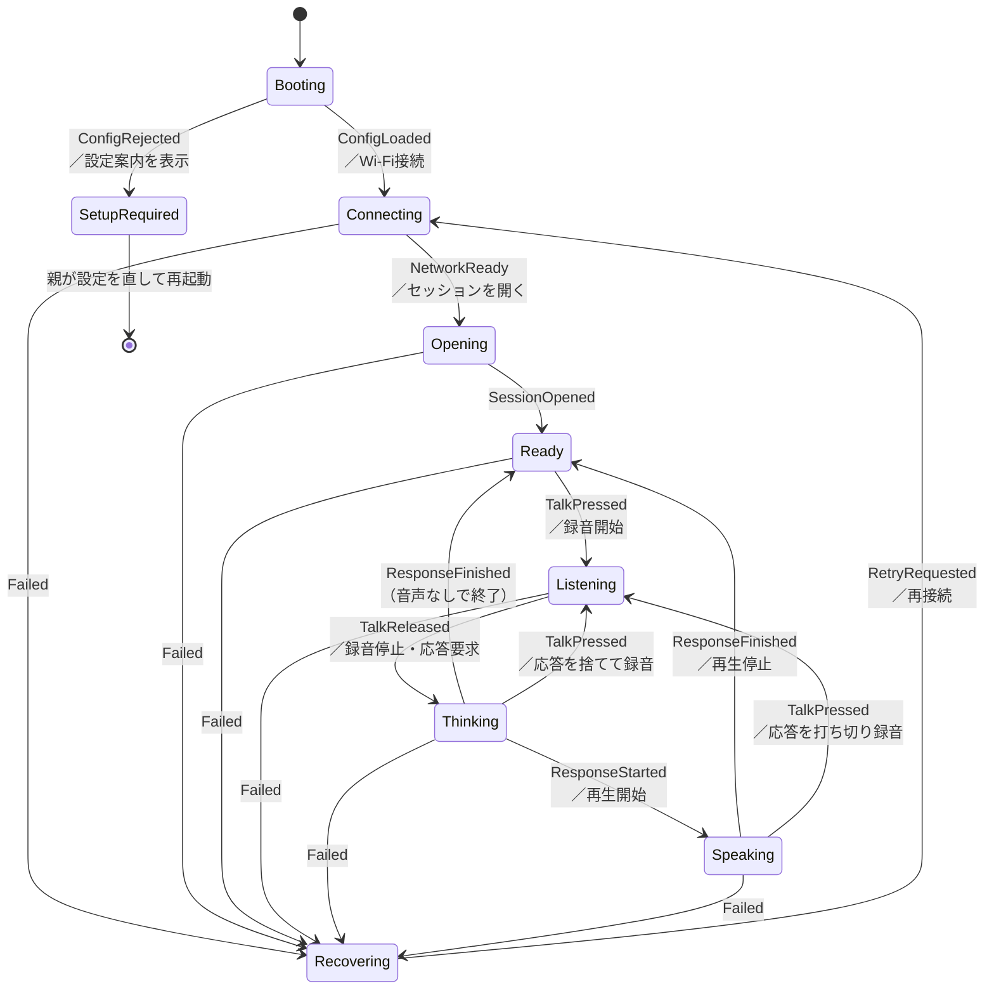

# 状態遷移

状態と、それを動かすきっかけの対応は `core/src/state.rs` に純粋関数として
置いている。画面の表情も音声の開始・停止も、すべてこの遷移から導く。

## 状態遷移図

## 設計上の判断

**応答中の割り込みを許す** — 子どもは相手の話し終わりを待たない。
`Speaking` や `Thinking` の最中にボタンを押されたら、生成中の応答を
打ち切って `Listening` に移る。これを許さないと会話が成立しない。

**失敗はどの状態からでも起こる** — `Failed` はどの状態から来ても
録音・再生の停止、セッションの切断、親への表示をまとめて行い
`Recovering` に移る。個々の状態ごとに書き分けると取りこぼしが出る。

**意味を持たないきっかけは捨てる** — たとえば `SetupRequired` での
ボタン操作は無視する。取りこぼしても害がないため、エラーにしない。

## 依頼する処理

遷移は次の処理を依頼する。実際に何をするかは実機側の担当。

| 依頼 | 内容 |
|---|---|
| `ConnectNetwork` / `OpenSession` / `CloseSession` | 接続の開始と終了 |
| `StartCapture` / `StopCapture` | マイクの取り込み |
| `RequestResponse` | 録音を確定して応答を求める |
| `CancelResponse` | 生成中の応答を打ち切る |
| `StartPlayback` / `StopPlayback` | 応答音声の再生 |
| `ShowSetupGuide` / `ShowFailure` | 親への表示 |
